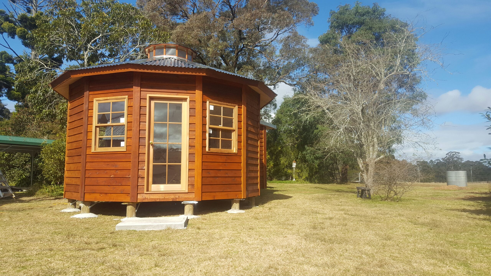

    

#The Brand
***
Based out of Goulburn and servicing nationwide, Australian Roundhouses has been in the business since 1987. Up until recently they were trading under the name Goulburn Yurtworks, but Australian Roundhouses is pushing away from the word "yurt", as they do not sell yurts but round houses.

    

#The Project
***
Goulburn Yurtworks was a very well known name in their industry. To make a smooth transition to the new name, Australian Roundhouses will use the existing digital presence to promote their new brand identity. A complete new re-designed logo along with website will give the new company good kick start to gaining the trust of old clients and finding new ones.

    

#The Result
***
The project is still under way but is due for completion by mid-July*. 

    

