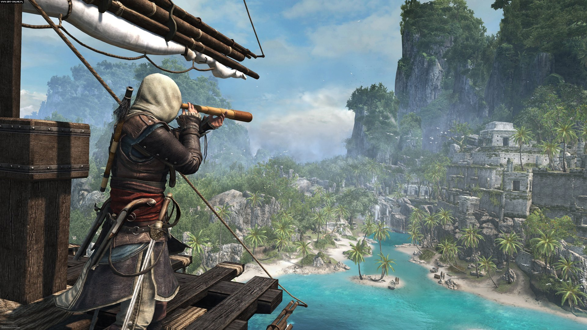

    

#Introduction
The Assassins Creed franchise was created back in 2007 by Ubisoft through the release of their first major triple-A game, Assassin's Creed. Since then Ubisoft has used various mediums to distribute content to their audience including Video Games (PC, Xbox, PlayStation and Mobile), Movies, Short Films, Novels (both text based and graphic) and Comic Books. For the purposes of keeping this case study short the basic plotline can be found <a href="http://www.eurogamer.net/articles/2015-10-21-assassins-creed-the-story-so-far_6">here</a>

#Meta Narrative
***
The overall structure of the Assassin's Creed universe was not very well thought out. Even the major Video Game releases were out of historical order. The first five major games in the series focused on the main character, Desmond Miles, and him reliving his ancestors, Altaïr and Ezio, genetic history through the use of metanarrative. Each new release featured another part of a continuing linear storyline, which engaged the audience to keep pursuing the narrative.

#Transmedia Story world
***
The AC universe is set in a transmedia story world. The video games all take place within the same universe and follow the same storyline. Each addition adds casual effect from the previous release, at least up to the fifth game in the series. By the sixth instalment of the major video game releases, they began focusing on different characters, creating a nonlinear storyline that jumped back and forth between locations, characters and timelines. Desmond's story ends at the end of AC III after he saves the world form a meteor. This is only vaguely talked about in the sixth instalment, AC IV: Black Flag, even though his narrative has no effect on that of the new protagonist of Edward Kenway.

####Platforms
#Transmedia Storytelling
***
Across the AC universe, one major protagonist has transitioned over mediums. Shao Jun is a Chinese assassin that originated from the AC: Embers animated short film. Four years later Shao Jun was the main character of the AC Chronicle: China video game but the game itself contradicted much of what the audience learnt about the character from the AC: Embers animated short. This made the previous short almost irrelevant to the characters development on the new medium. 

####Platforms
#Short Films
***
Whilst the main video games were being made and released, Ubisoft (and/or companies contracted to) co-created narratives across different mediums. The original major release of AC occurred in 2007 and by 2009 the first three-part web series had been released, AC: Lineage. The films focus on the additional backstory of Ezio Auditore and were released to help promote the sequel; which was to be released a month later. This primer encouraged web viewers to refer to the video game platform to continue the narrative using multi-platform serial, and giving the viewers a reward. 

#### Audience
#Target Audience
***
The target audience for the Assassin's Creed universe is quite large. Specifically, their major AAA releases are targeted towards males because males spend more time and money on video games, in comparison to females. The 2012 study <a href="http://usabilitynews.org/video-games-males-prefer-violence-while-females-prefer-social/">"Video Games: Males Prefer Violence while Females Prefer Social"</a>, found that females would much rather watch long amounts of TV. It found that females feel guilty when they do play video games. It also found that females prefer consoles of desktop gaming, and females make up a greater market share on the mobile platform.

So with all this research, it is no surprise that the main AC games are marketed towards a more male-dominated audience. A greater percentage of males prefer violent games than opposed to the female percentage. Females prefer casual, simulation games with little to no violence. Male protagonists have been the main focus for their triple-A titles, but AC: Syndicate released with two main characters. One male and one female. Ubisoft was praised for finally giving females a part in the AC universe, and boosted sales of that particular release. Hopefully, Ubisoft takes this into account when developing future additions to the series.

In the past decade, since the release of more powerful and portable devices, mobile gaming has been on the rise. According to <a href="https://newzoo.com/insights/articles/global-games-market-reaches-99-6-billion-2016-mobile-generating-37/">NewZoo</a>, mobile gaming is expected to make up a 34% market share by the year 2019. Ubisoft has taken the opportunity to release several narratives on the mobile platform. The most recent addition is AC: Rebellion. Ubisoft has used a completely different art style and change up the gameplay to differ greatly from the major triple A titles. The article, "The new Assassin's Creed mobile game will kill you with cuteness", says it all. The game is aimed towards a more fun and playful audience, females. This is not to say males won't engage with the game, but it is definitely targeted for the platform, the mobile platform where more females are participating. 

#### Analysis
#Emersion
***
"The first and most important thing to know about games is that they center on PLAY. Unlike literature and film, which center on STORY, in games, everything revolves around play and the player experience. Game designers are much less interested in telling a story than in creating a compelling framework for play." (<a href="http://electronicbookreview.com/thread/firstperson/tamagotchi">Pearce 2004)</a>

Celia Pearce poses an interesting concept. Video games are made to focus on gameplay as opposed to the story. Within the AC universe, it could be argued that this statement is in fact true. Although the universe is built around a transmedia story world, the focus is still on the gameplay. One could say this is why Ubisoft keep recycling the blueprint of each new instalment of the game because they are so focused on creating captivating and engaging gameplay as opposed to a quality narrative.

#### Analysis
#Static Mediums
***
Contradictory to the above statement comes the other mediums Ubisoft use to present the AC universe. The use of novels, film and advertising cannot engage the user in the same way playing a video game does. Therefore the narrative style must change to be able to engage the audience. Within these linear storytelling mediums, the user has no control over what happens when. Whereas the video games give the user freedom to go at their own pace, soak up the stunning visuals, explore the large world, engage in combat and complete the story in their own time. Yes, the narrative may still seem linear, but the user is rewarded for going off track, by doing side quests away from the main narrative.

#### Analysis
#Subjectivity
***
Throughout the AC video game releases, you play as the Assassin, a part of the Brotherhood, or the "good guys". But AC: Rogue tips that concept on its head. The seventh instalment of the video game has the user playing as an Assassin turned Templar and makes the user experience a new perspective. It makes the players question the whole narrative up to that particular point in time and that maybe the Templars have been the good guys all along. This subjectivity gives perspective and insight into how the "bad guys" feel, and what their means and motives are. 

#### Analysis
#Co-Creation (and how Ubisoft screwed it up)
***
Assassins Creed as a whole universe never intended to reach further than the video games. Ubisoft, the company that created and owns the AC franchise, makes video games, that’s what they do. So when it came to branching out to different mediums they contracted other companies to help out. This could be the main reason why certain mediums contradict one other with characters and their meta-universe. Henry Jenkins mentions that transmedia storytelling works best either in small independent teams or across a strong team of collaborators <a href="http://henryjenkins.org/2007/03/transmedia_storytelling_101.html">Jenkins 2007</a>). This is something that Ubisoft could have pulled off if they had planned and collaborated in a more effective and thorough way with their partner companies. Even small details as to which hand the protagonist wields their weapons from are just enough for audiences to notice and doubt what is real in the universe.

#### Analysis
#Additive Comprehension
***
Almost all the content within the assassins creed universe is accessible on its own. Each new addition gives the overall universe additive comprehension. The first five major video games follow the same character and rely on the previous addition to build on the story. But all other additions after the fifth instalment are available on their own and do not rely on previous or future stories.

#### Analysis
#Underlying Trans Media Story World & Collective Intelligence
***
A brief note should be made that there are theories claiming that all* Ubisoft games connect to each other (*Their major story bases franchises). There are a lot of factors that back up these theories. A great example is that each Ubisoft game has some sort of "eagle vision" aspect to it. Both Far Cry and Watch_Dogs have these "eagle visions" through their instalments. These two other franchises could possibly fit within the same transmedia universe as Assassins Creed, even though they never directly reference back to each other. Creating these subtle links Ubisoft has sparked intriguing conversation amongst online communities, a collective intelligence. Anyone on the internet can participate in sharing their thoughts and theories on the matter, or anything else about the AC universe.

#### Analysis
#Encyclopaedic Capacity & Extras
***
The internet is filled with user-generated information, both factually true, in reference to the AC universe, and theoretically based. A fan created AC wiki was created an <a href="http://assassinscreed.wikia.com/wiki/Assassin%27s_Creed_Wiki">Assassins Creed Wiki</a> and is maintained by the community. Ubisoft themselves have released 3 editions of a hardcover official <a href="https://www.amazon.com/Assassins-Creed-Encyclopedia-2nd-Edition/dp/8863552169">AC Encyclopedia</a>. The AC encyclopedia is the most popular of the encyclopaedic styled print mediums. Other offerings include visual histories and gameplay guides (to accompany each major game release). 

#### Analysis
#Audience
***
Assassins Creed has a great concept. Set in the current day, where the main protagonist, Desmond Miles, is to relive his ancestors genetic-history as an assassin. Somehow Ubisoft managed to screw it up by milking the series; using the same plot line for each new release. The audience is very divided on whether new additions are even worth buying, not just for the repetitive storylines, but because of the lack of optimisation the games release with. The biggest major let down from Ubisoft was AC: Unity. Critics took quite lightly to the game at its initial buggy release praising the next-gen graphics and enhanced combat system. "Unity feels like it was taken out of the oven too soon" (<a href="https://www.polygon.com/2014/11/11/7192467/assassins-creed-unity-review-xbox-one-PS4-PC">Gies 2014</a>). Consumers weren't so happy, one stating, "It looks to me like they butchered the story, release it in a broken state to meet the release date and nothing major added. It makes me wonder how they will continue milking this series" (<a href="https://www.trueachievements.com/n18811/ta-review-assassins-creed-unity">matdan 2014</a>)

#### Analysis
#Closing Thoughts
***
The overall concept and universe of Assassins Creed had, and could possibly still have so much potential. If Ubisoft were to listen to their audience and actually take on the criticism they would create a stellar universe using cross-media to engage and reach an even wider audience. Using short films as promotional material and engaging audiences across different mediums helped boost their mother mediums sales, even though the games were hated on by many.

#Hidden Markov Model
***
Ubisoft could even incorporate the Hidden Markov Model to help predict what their audience will engage with in the future. But this may be too advanced of a concept for the folks at Ubisoft. In short, the Markov Model is "…a possible effective way to measure transmedia success in terms story world narrative enjoyment…" (<a href="https://www.researchgate.net/profile/Tim_Van_Leeuwerden/publication/292976022_Transmedia_Storyteling_The_benefits_of_Participative_Consistency_and_the_Hidden_Markov_Model/links/56b323cf08aed7ba3fee66aa/Transmedia-Storyteling-The-benefits-of-Participative-Consistency-and-the-Hidden-Markov-Model.pdf">Leeuwerden 2016</a>). The model bases future phenomenon on the current state, not from the past. Ubisoft could utilise this to see what is currently appealing to their target audience and create relevant and engaging content to meet the needs in the future.

#Future of Ubisoft
***
It seems that in recent months Ubisoft has learned that releasing a new major video annually isn't such a good idea. Ubisoft CEO Yves Guillemot says, "With more time to polish our games, we have been able to release three high-quality titles since August […] We have fully embraced the significant increase in resources required to develop ever-bigger games." Future Ubisoft games will now have a greater level of care and hopefully focus on better optimisation, gameplay and most importantly the use of transmedia within the Assassins Creed universe.