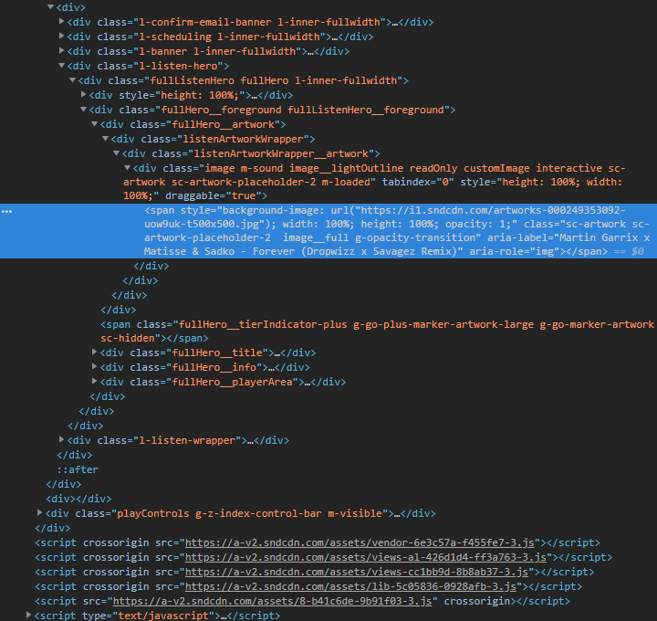

    

#The Project
The aim of this project was to streamline the music tagging process. An easy and automated image grabber will save a lot of time without having to touch a line of source code.

    
    

#The Problem 
***
The main reason for this small project is that many artists allow you to download their music off of Soundcloud. This is a great way to promote yourself as an artist. But majority of the time these artists don’t add metadata to their music. If you like order and album artwork this was an issue. Soundcloud doesn’t allow you to directly copy their images, and requires you to fish around in source code to find the image.

    

#The Result
***
The solution is a small Chrome Extension (the getMyCodePlease() function in the <a href="https://github.com/lukethacoder/GrabThatArtwork/blob/master/script.js" target="_blank">script.js</a> file can be run in the console of any browser). The original solution was a small function used to grab and open the image in a new tab, but the addition of an additional button to the current Soundcloud UI makes it that much easier to use. A simple click and you have the album artwork ready to add to your newly downloaded tunes.

<a href="https://github.com/lukethacoder/GrabThatArtwork" target="_blank">Github Repo</a> 