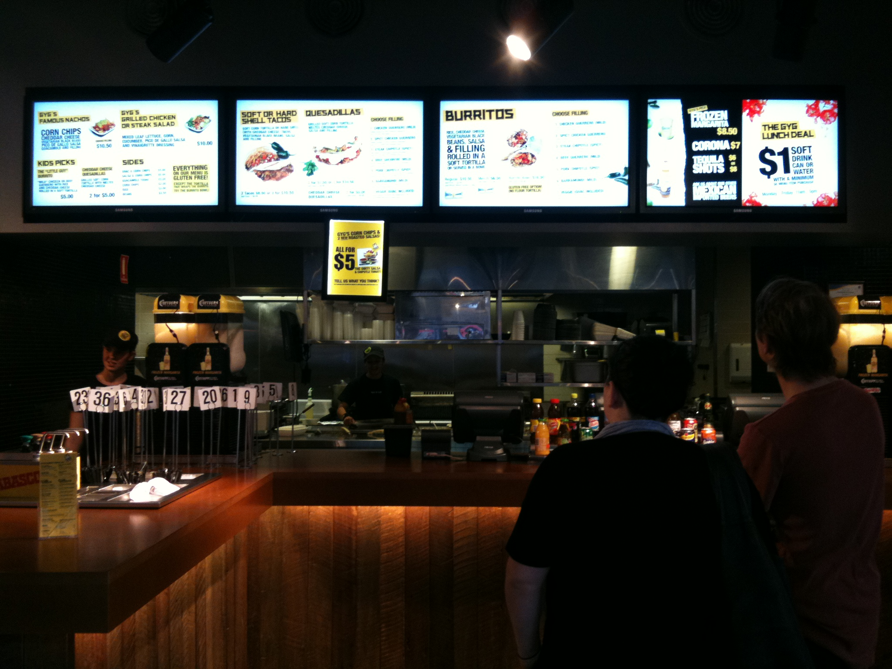

    

#Executive Summary
***
This document will outline the importance of web accessibility, why it is important, and ways to improve the accessibility of the Guzman y Gomez website. It will look at the target groups that use the website in alternate ways to the average user and how the overall accessibility of the website can be improved.

#Download the PDF.
***
Because of the nature of this report, a pdf download <a href="./Guzman y Gomez - Accessibility Audit.pdf" download>here</a> is supplied instead of being displayed on this website.