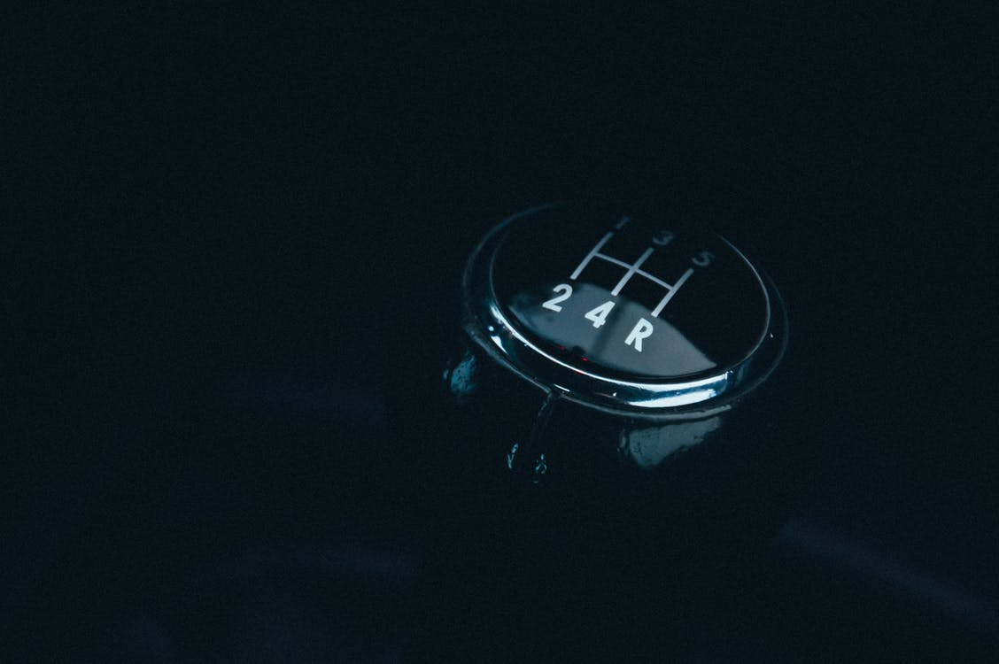
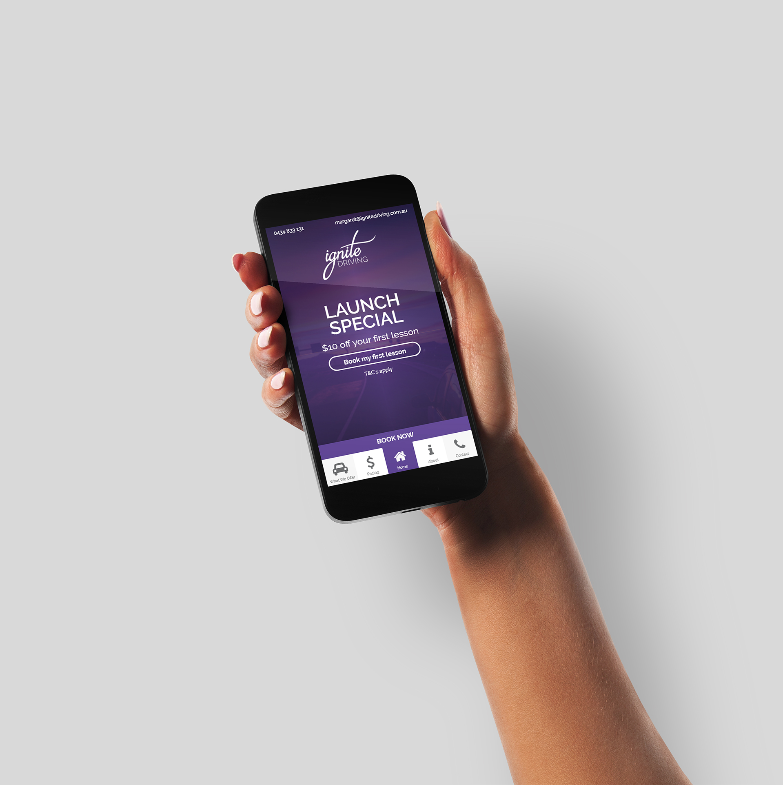
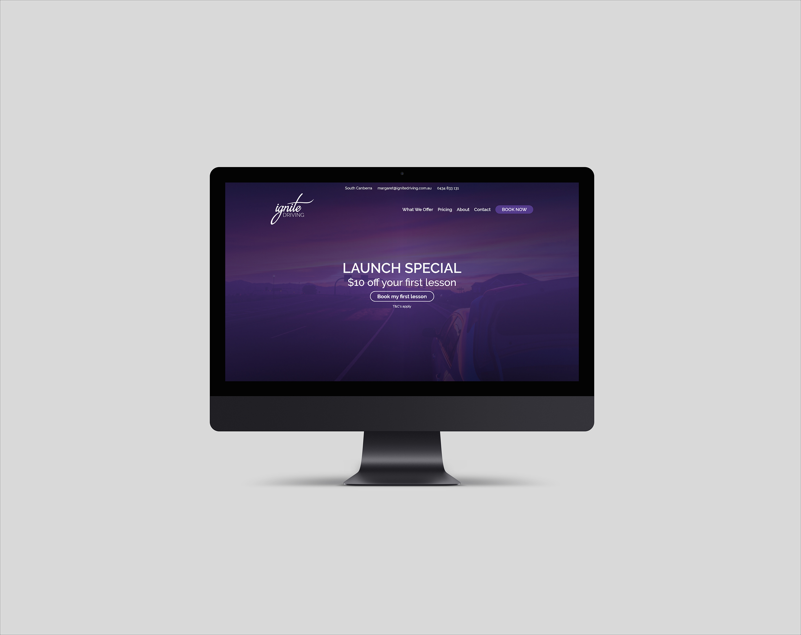
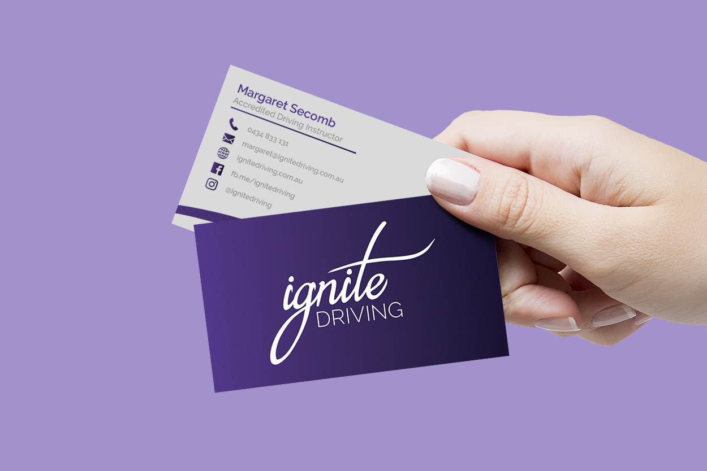

    

#The Brand
***
Based in South Canberra, Ignite Driving is a newly founded small business that aims to help Learner drivers transition to become safe and confident P plate drivers. Through the use of thorough and informative teaching techniques, Ignite driving is putting safer drivers on Canberra roads.

    
    
    
    
    
    

#The Project
***
Starting a brand from scratch is always a difficult process. It began with the design of the logo. Inspired by a flowing flame of sorts the cursive typography of the "ignite" contrasts with the sans serif "driving" type. The overall aesthetic follows hues of purple, oranges, and shades of grey.

    
    

#The Result
***
The project has been completed, but is still undergoing review with the development. Small bugs are being thinned out and fixed up - and optimisations are always being developed. Additionally, there is a car wrap design that is in the process of being created. This will be used on the company car and will help it stand out when traveling the roads of Canberra.

    

#Technologies Used
***
This project used reasonably standard technologies. The stand out is GatsbyJS. A new kid on the block, GatsbyJS is a React based static site generator. Spitting out a static website drastically cuts down on load times and in doing so ups the page ranking of the website, which is always a good thing.