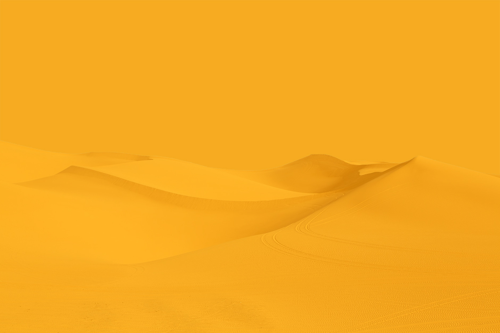

<!-- 

    

 -->

#The Project
This is still a work in progress. Will post random/test stuff here 

#animie.js logo animation
<iframe height='450' scrolling='no' title='Luke Secomb Digital Anime.js Logo Animation' src='//codepen.io/lukethecoder/embed/BxLwJW/?height=265&theme-id=dark&default-tab=html,result&embed-version=2' frameborder='no' allowtransparency='true' allowfullscreen='true' style='width: 75%; justify-self: center; margin-top: 25px;'>See the Pen <a href='https://codepen.io/lukethecoder/pen/BxLwJW/'>Luke Secomb Digital Anime.js Logo Animation</a> by Luke Secomb (<a href='https://codepen.io/lukethecoder'>@lukethecoder</a>) on <a href='https://codepen.io'>CodePen</a>.
</iframe>