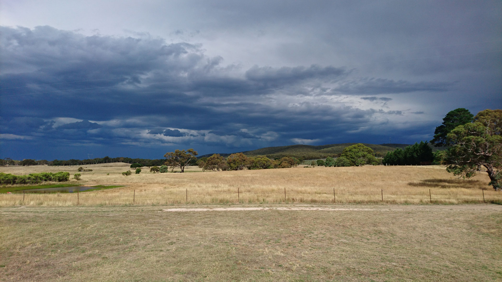

    

#The Brand
***
Nanga Mai Services is a Succession Facilitator and Farm Consultant company. Based out of the Goulburn area they service most of the NSW region. With over 10 years of experience in the industry Nanga Mai Services is perfect for your needs.

    
    
    
    
    
    

#The Project
***
Design direction, including a logo and website design, were the main parts of the project. The client was after a professional look, but also not to stem too far away from the 'farm' aesthetic. The use of a background image from the clients business location mixed with a friendly photo of the CEO greets potential clients with a warm and welcoming feeling.

    
    

#The Result
***
The recent re-design of the website is due to be updated. The designs above are what the website will look like.

    

<!-- 
#Technologies Used
*** -->