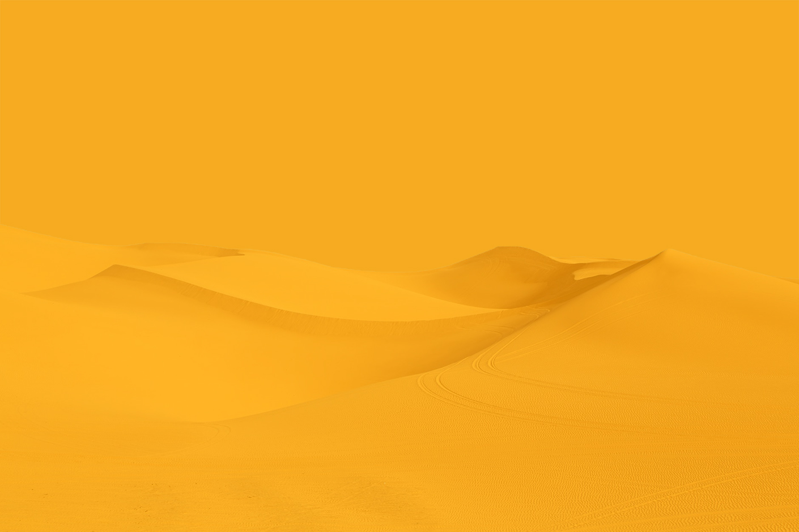

    

#The Project
This is still a work in progress and will be finished by the due date, mid May. 

#Technologies Used 
***
Zoostagram uses React, as well as utalising SASS and other NPM technologies. Google Firebase is used to store all user and quiz data, as well as provide authentication for users.